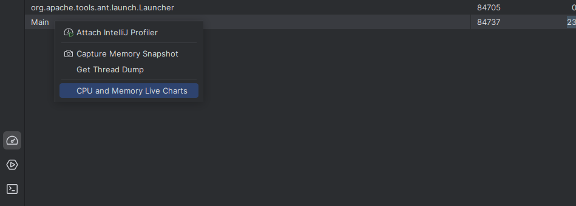
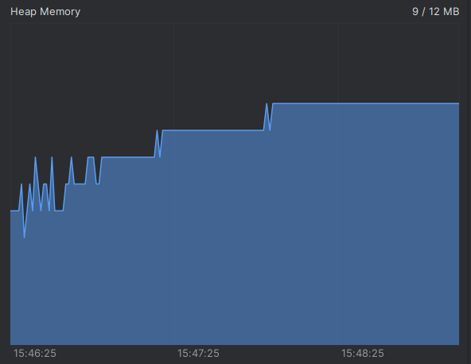
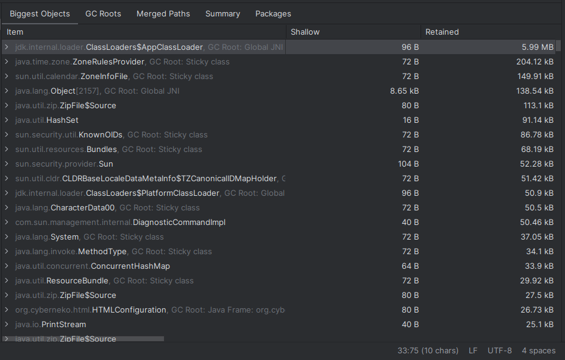
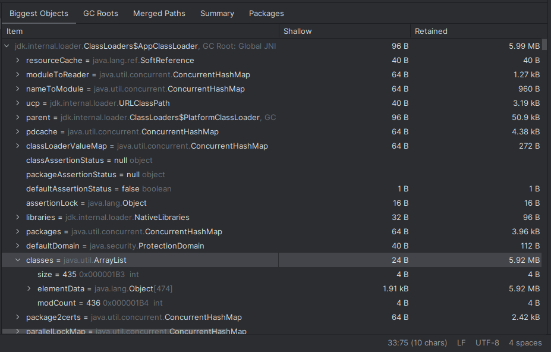
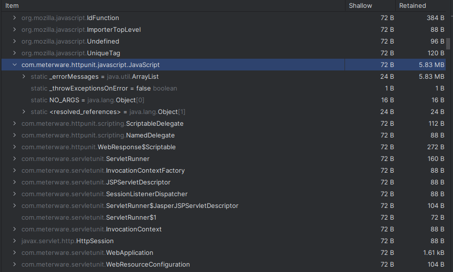
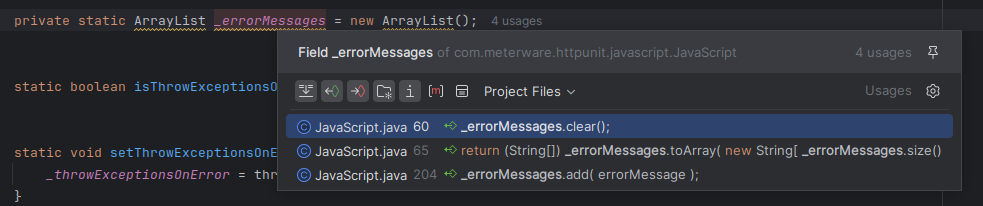
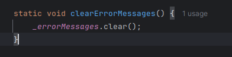
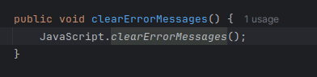
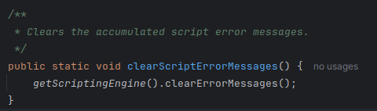
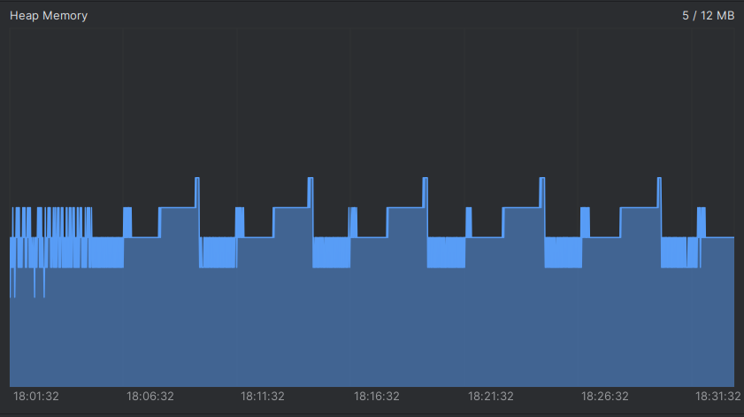

= Устранение проблемы с производительностью в программе HttpUnit
:source-highlighter: highlight.js
:data-uri:
:figure-caption!:

== Локализация проблемы

Для начала ознакомимся с запускаемым кодом.

[source, java]
----
/* Main.main */
public static void main(String[] args) {
    try {
        HttpUnitOptions.setExceptionsThrownOnScriptError(false);
        ServletRunner sr = new ServletRunner();
        sr.registerServlet("myServlet", HelloWorld.class.getName());
        ServletUnitClient sc = sr.newClient();
        int number = 1;
        WebRequest request = new GetMethodWebRequest("http://test.meterware.com/myServlet");
        while (true) {
            WebResponse response = sc.getResponse(request);
            System.out.println("Count: " + number++ + response);
            java.lang.Thread.sleep(200);
        }
    } catch (InterruptedException ex) {
        Logger.getLogger("global").log(Level.SEVERE, null, ex);
    } catch (MalformedURLException ex) {
        Logger.getLogger("global").log(Level.SEVERE, null, ex);
    } catch (IOException ex) {
        Logger.getLogger("global").log(Level.SEVERE, null, ex);
    } catch (SAXException ex) {
        Logger.getLogger("global").log(Level.SEVERE, null, ex);
    }
}

/* HelloWorld.doGet */
public void doGet(HttpServletRequest request, HttpServletResponse response) throws ServletException, IOException {
    PrintWriter out = response.getWriter();
    response.setContentType("text/html");
    out.println("<!DOCTYPE HTML PUBLIC \"-//W3C//DTD HTML 4.0 " +
                                    "Transitional//EN\">\n" +
            "<HTML>\n" +
            "<HEAD><TITLE>Hello World</TITLE></HEAD>\n" +
            "<BODY>\n" +
            "<H1>Hello World</H1>\n");
    out.println("");
    out.println("</BODY></HTML>");
}
----

`HelloWorld` представляет из себя сервлет обрабатывающий GET запрос и отвечающий html страницей с JavaSciprt скриптом. `Main.main` же, с помощью библиотеки `HttpUnit`, в бесконечном цикле отправляет GET запросы с интервалом в 200 мс на `HelloWorld` сервлет.

Для того чтобы понять в чем заключается искомая проблема с производительностью, запустим программу и, используя профайлер IntelliJ IDEA, начнем наблюдать за метриками процесса (CPU, Heap Memory, Threads, Non-Heap Memory).

После определенного времени можно заметить, что диаграмма Heap Memory представляет собой "ступенчатый" график и постепенно увеличивается, что свидетельствует об утечке памяти, так как в нормально работающей программе в связи с переодическими сборками мусора график должен быть "пилообразным".

В добавок к этому, если позволить процессу работать достаточно продолжительное время, у JVM закончится выделенна память и програма выйдет с ошибкой `OutOfMemory`

Следующим шагом необходимо выявить где конкретно происходит утечка. Для этого опять запустим программу и подключим профайлер к процессу, однако в этот раз мы сделаем два снапшота памяти (кнопка слева от диаграмм). Один в начале работы программы, когда Heap Memory примерно стабилизировалась у 5-6 МБ, а второй ближе к концу, когда график достиг 9 МБ. (Для более быстрой утечки памяти и ускорения процесса можно убрать вызов `Thread.sleep`).

В итоге, сравнив получившиеся снапшоты, а конкретно вкладку "Biggest Objects", бросается в глаза большая разница в размерах класса `ClassLoader$AppClassLoader` (~ 3.6 МБ, как раз столько, сколько утекло памяти согласно профайлеру)

[cols="a,a", frame=none, grid=none]
|===
|
.Снапшот 1

|
.Снапшот 2

|===

Раскрыв класс, видно что разница в памяти возникла из-за единственного объекта `AppClassLoader.classes.elementData`

[cols="a,a", frame=none, grid=none]
|===
|
.Снапшот 1

|
.Снапшот 2

|===

Пробравшись дальше, мы наблюдаем что `classes.elementData` это список загруженных в JVM классов и промотав немного вниз можно обнаружить довольно большой, по сравнению с другими элементами, класс: `httpunit.javascript.JavaScript`. Он, а конкретно его статическое поле-массив `_errorMessages` и является виновником утечки 

[cols="a,a", frame=none, grid=none]
|===
|
.Снапшот 1

|
.Снапшот 2

|===

== Устранение утечки

Для устранения утечки, очевидно, достаточно просто чистить массив `JavaScript._errorMessages`. Пробравшись через цепочку различных `clear` методов в итоге мы приходим к `HttpUnitOptions.clearScriptErrorMessages`.

Исправим `main` функцию, добавив в цикл очистку сообщений об ошибках

[source, java]
----
/* Main.main */
// ...
while (true) {
    WebResponse response = sc.getResponse(request);
    System.out.println("Count: " + number++ + response);
    java.lang.Thread.sleep(200);
    HttpUnitOptions.clearScriptErrorMessages(); // <--
}
// ...
----

== Проверка работы программы

Проделаем те же самые действия которые были выполнены для локализации утечки и запустим программу с профайлером.

В результате, за ~30 минут работы программы, Heap Memory ни разу не превысила 7 МБ и никаких признаков роста не наблюдается, следовательно мы успешно устранили утечку.
